# Validating MCP Server in VS Code Copilot

---

## Table of Contents

- [Part 1 — Adding Your MCP Server to VS Code Copilot](#part-1--adding-your-mcp-server-to-vs-code-copilot)
  - [Method 1: Using the Command Palette (Recommended)](#method-1-using-the-command-palette-recommended)
  - [Method 2: Manually Editing `.vscode/mcp.json` (Workspace Scope)](#method-2-manually-editing-vscodemcpjson-workspace-scope)
  - [Method 3: Manually Editing User `mcp.json` (User Scope)](#method-3-manually-editing-user-mcpjson-user-scope)
  - [Adding Authentication Headers (Optional)](#adding-authentication-headers-optional)
  - [Full Configuration Reference](#full-configuration-reference)
- [Part 2 — Validating Your MCP Server](#part-2--validating-your-mcp-server)
  - [Step 1 — Open the MCP Servers Panel](#step-1--open-the-mcp-servers-panel)
  - [Step 2 — Start the Server (if not running)](#step-2--start-the-server-if-not-running)
  - [Step 3 — Inspect Discovered Tools](#step-3--inspect-discovered-tools)
  - [Step 4 — Check the Output Logs](#step-4--check-the-output-logs)
  - [Step 5 — Restart the Server After Changes](#step-5--restart-the-server-after-changes)
- [Part 3 — Testing Your MCP Server Tools](#part-3--testing-your-mcp-server-tools)
  - [Step 1 — Switch to Agent Mode](#step-1--switch-to-agent-mode)
  - [Step 2 — Invoke a Tool via Natural Language](#step-2--invoke-a-tool-via-natural-language)
  - [Step 3 — Invoke a Tool Explicitly with `#`](#step-3--invoke-a-tool-explicitly-with-)
  - [Step 4 — Review the Tool Call Details](#step-4--review-the-tool-call-details)
  - [Step 5 — Confirm via Output Panel](#step-5--confirm-via-output-panel)
- [Quick Reference — Key Commands](#quick-reference--key-commands)
- [Summary](#summary)

---


## Part 1 — Adding MCP Server to VS Code Copilot

There are three ways to register MCP server. Choose the one that best fits your workflow.

---

### Method 1: Using the Command Palette (Recommended)

This is the quickest way to add your server without editing files manually.

**Step 1 — Open the Command Palette**

Press `Ctrl+Shift+P` on Windows/Linux or `Cmd+Shift+P` on macOS.

**Step 2 — Run the Add Server Command**

Type `MCP: Add Server` and select it from the list.

```
> MCP: Add Server
```

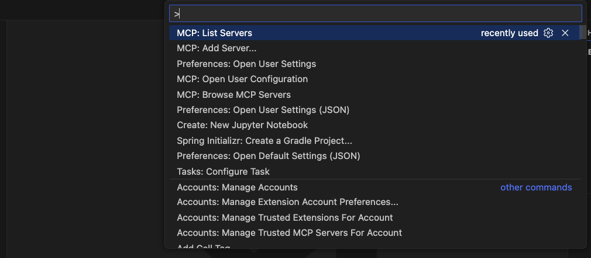

**Step 3 — Select the Transport Type**

A picker will appear with the transport options. Select:

```
HTTP (SSE)
```

> SSE (Server-Sent Events) is the correct choice for your server since your URL ends in `/sse`.

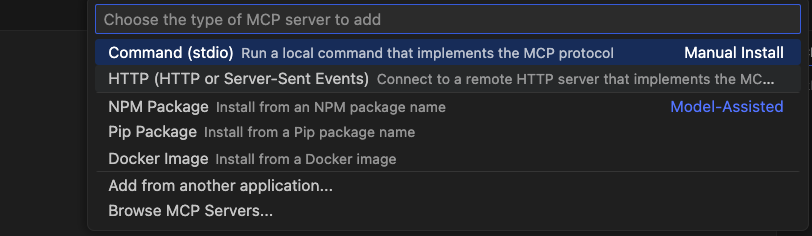

**Step 4 — Enter Your Server URL**

When prompted for the URL, paste exactly:

```
http://localhost:8000/mcp/v1/sse
```

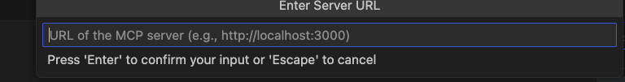

**Step 5 — Enter a Server Name**

Give your server a short, descriptive ID (no spaces). For example:

```
my-mcp-server
```
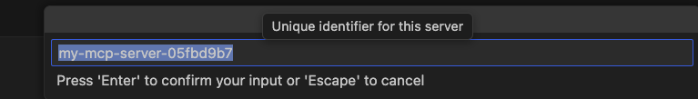

**Step 6 — Choose the Configuration Scope**

VS Code will ask where to save the configuration:

| Option | Where it's stored | Best for |
|---|---|---|
| **User Settings** | Global `mcp.json` | Available across all your projects |
| **Workspace Settings** | `.vscode/mcp.json` in current folder | Shared with your team via source control |

After selecting, VS Code automatically writes the configuration and the server entry appears in the MCP panel.

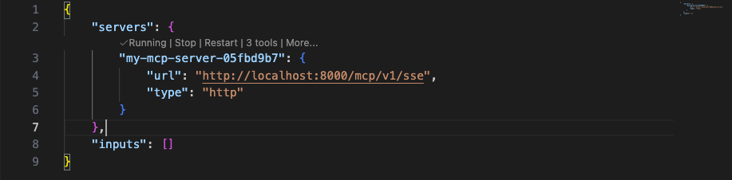
---

### Method 2: Manually Editing `.vscode/mcp.json` (Workspace Scope)

Use this method when you want the server configuration committed alongside your project code.

**Step 1 — Create the file (if it doesn't exist)**

In the root of your project, create:

```
.vscode/mcp.json
```

**Step 2 — Add the server configuration**

```jsonc
{
  // MCP server configuration for this workspace
  "servers": {
    "my-mcp-server": {
      "type": "sse",
      "url": "http://localhost:8000/mcp/v1/sse"
    }
  }
}
```

**Step 3 — Save the file**

VS Code detects the change automatically. The server will appear in the MCP servers list within a few seconds.

> **Tip:** You can add this file to source control so your entire team gets the same MCP server configuration automatically when they open the workspace.

---

### Method 3: Manually Editing User `mcp.json` (User Scope)

Use this when you want the server available globally across **all** your VS Code workspaces.

**Step 1 — Open the User-level `mcp.json` file**

Press `Ctrl+Shift+P` / `Cmd+Shift+P` and run:

```
Preferences: Open User Settings (JSON)
```

Then navigate to the user-level `mcp.json` file located at:

| OS | File Path |
|---|---|
| **Windows** | `%APPDATA%\Code\User\mcp.json` |
| **macOS** | `~/Library/Application Support/Code/User/mcp.json` |
| **Linux** | `~/.config/Code/User/mcp.json` |

> If the file doesn't exist, create it at the path above.

**Step 2 — Add the server configuration**

```jsonc
{
  "servers": {
    "my-mcp-server": {
      "type": "sse",
      "url": "http://localhost:8000/mcp/v1/sse"
    }
  }
}
```

**Step 3 — Save the file**

The server is now registered globally and will be available in every workspace you open.

---

### Adding Authentication Headers (Optional)

If your MCP server requires an API key or Authorization token, add a `headers` block:

```jsonc
{
  "servers": {
    "my-mcp-server": {
      "type": "sse",
      "url": "http://localhost:8000/mcp/v1/sse",
      "headers": {
        "Authorization": "Bearer ${input:myToken}"
      }
    }
  },
  "inputs": [
    {
      "id": "myToken",
      "type": "promptString",
      "description": "Enter your MCP Server API Token",
      "password": true
    }
  ]
}
```

> VS Code will prompt you to enter the token securely the first time the server starts. The `"password": true` flag hides the input.

---

### Full Configuration Reference

Below is the complete schema for a single server entry:

```jsonc
{
  "servers": {
    "<server-id>": {
      // Required: transport type
      "type": "sse",                          // "sse" | "stdio" | "http"

      // Required for SSE/HTTP transport
      "url": "http://localhost:8000/mcp/v1/sse",

      // Optional: custom HTTP headers
      "headers": {
        "Authorization": "Bearer <token>"
      },

      // Optional: environment variables (for stdio servers only)
      "env": {
        "MY_VAR": "value"
      }
    }
  }
}
```

---

## Part 2 — Validating Your MCP Server

Once your server is registered, follow these steps to confirm it's correctly connected and recognized by VS Code Copilot.

---

### Step 1 — Open the MCP Servers Panel

Press `Ctrl+Shift+P` / `Cmd+Shift+P` and run:

```
MCP: List Servers
```

You should see your server listed:

```
my-mcp-server   ●  Running   (SSE)
```

The **green dot** (●) confirms the server is connected. A **red dot** or "Stopped" status means VS Code cannot reach it.

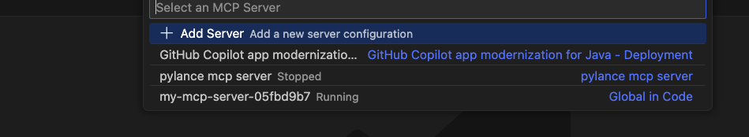

---

### Step 2 — Start the Server (if not running)

If the server shows as "Stopped", start it from the Command Palette:

```
MCP: Start Server
```

Select `my-mcp-server` from the picker. VS Code will attempt to connect to `http://localhost:8000/mcp/v1/sse`.

---

### Step 3 — Inspect Discovered Tools

After a successful connection, VS Code queries your server for its tool manifest. To see what tools were discovered:

1. Open Copilot Chat: `Ctrl+Alt+I` (Windows/Linux) or `Cmd+Alt+I` (macOS)
2. Make sure you're in **Agent mode** (not Ask or Edit mode) — look for the mode selector in the chat input
3. Click the **Tools icon** (wrench/hammer icon `🔧`) in the chat toolbar

A panel opens showing all available tools grouped by server. You should see your server `my-mcp-server` listed with all the tools it exposes.

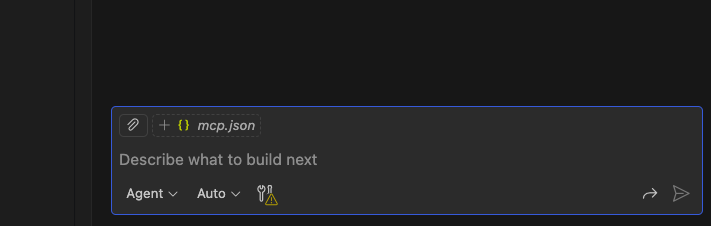

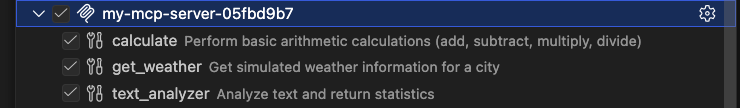
---

### Step 4 — Check the Output Logs

The Output panel shows detailed connection and protocol-level logs.

**Step 4a — Open the Output Panel**

Press `Ctrl+Shift+U` (Windows/Linux) or `Cmd+Shift+U` (macOS).

**Step 4b — Select the MCP log channel**

In the Output panel dropdown, look for:

```
MCP: my-mcp-server
```

or

```
GitHub Copilot Chat
```
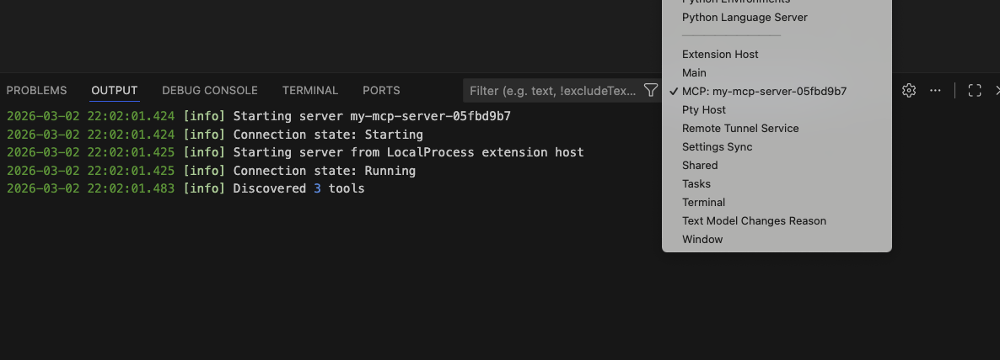

**What to look for in the logs:**

| Log Message | Meaning |
|---|---|
| `Connected to SSE endpoint` | Server connection successful |
| `Discovered N tools` | Tools fetched from your server |
| `Connection refused` | Server is not running at the URL |
| `Timeout` | Server is reachable but not responding |
| `401 Unauthorized` | Auth token missing or invalid |

---

### Step 5 — Restart the Server After Changes

When you make changes to your MCP server (new tools, updated schemas), restart it so VS Code re-fetches the tool manifest:

```
MCP: Restart Server  →  my-mcp-server
```

---

## Part 3 — Testing Your MCP Server Tools

Once validated, you can test your tools directly from Copilot Chat.

---

### Step 1 — Switch to Agent Mode

In the Copilot Chat panel, click the mode selector and choose **Agent**. Agent mode is required for MCP tools to be invoked.

---

### Step 2 — Invoke a Tool via Natural Language

Type a prompt that naturally maps to one of your tool's capabilities. Copilot will automatically select and call the appropriate tool from your MCP server.

**Example prompt:**

```
Use my-mcp-server to get the current server status
```

Copilot will:
1. Select the matching tool from `my-mcp-server`
2. Show you which tool it's about to call and with what parameters
3. Ask for confirmation (depending on the tool type)
4. Execute the call and return the response

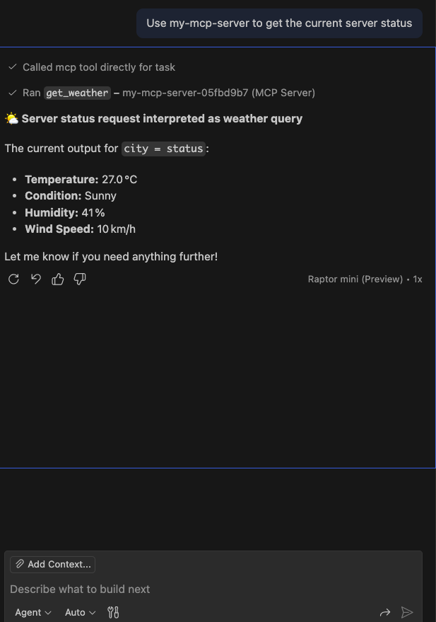
---

### Step 3 — Invoke a Tool Explicitly with `#`

You can directly reference a specific tool using the `#` tool picker:

1. In the chat input, type `#`
2. A dropdown of all available tools appears
3. Type your tool name to filter, e.g. `#my-mcp-server_get_status`
4. Select it and add any additional context in your message

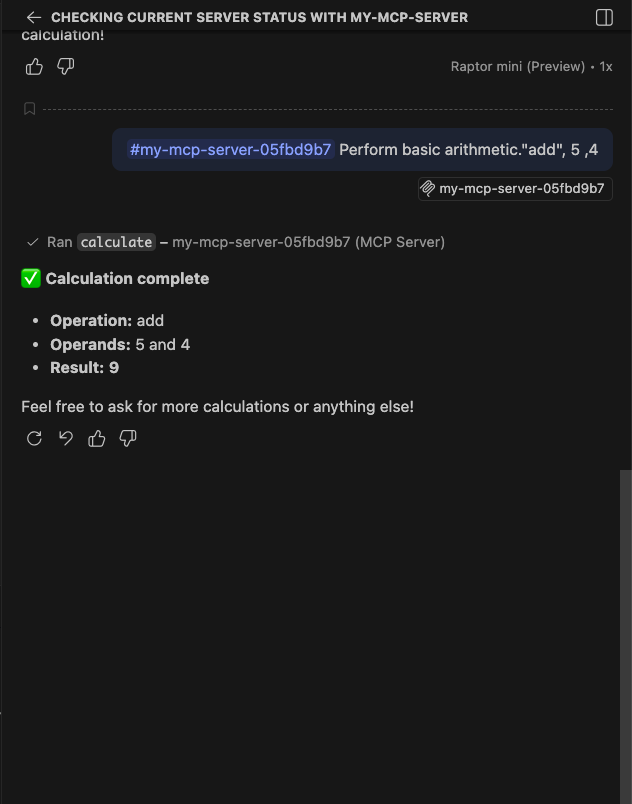

---

### Step 4 — Review the Tool Call Details

When Copilot invokes a tool, it displays a **tool call card** in the chat showing:

- The tool name
- The input parameters it sent
- The raw response from your server
- Whether the call succeeded or failed

This makes it easy to verify that your server is receiving the correct inputs and returning the expected outputs.

---

### Step 5 — Confirm via Output Panel

While testing, keep the Output panel open (`Ctrl+Shift+U`) on the `MCP: my-mcp-server` channel. Each tool call will log:

```
→ tools/call  { "name": "your_tool_name", "arguments": { ... } }
← result      { "content": [ ... ] }
```

This gives you a raw view of the MCP protocol messages for debugging.

---


## Quick Reference — Key Commands

| Command | Description |
|---|---|
| `MCP: Add Server` | Register a new MCP server |
| `MCP: List Servers` | View all configured servers and their status |
| `MCP: Start Server` | Start a stopped server |
| `MCP: Stop Server` | Stop a running server |
| `MCP: Restart Server` | Restart and re-fetch tools from server |
| `Preferences: Open User Settings (JSON)` | Navigate to global `mcp.json` |

---

## Summary

| Task | Location |
|---|---|
| Add server (workspace) | `.vscode/mcp.json` → `servers` block |
| Add server (global) | User `mcp.json` → `servers` block |
| Transport type for your server | `"type": "sse"` |
| Your server URL | `http://localhost:8000/mcp/v1/sse` |
| View connection logs | Output panel → `MCP: my-mcp-server` |
| Test tools | Copilot Chat in Agent mode |
| Refresh tool list | `MCP: Restart Server` |
